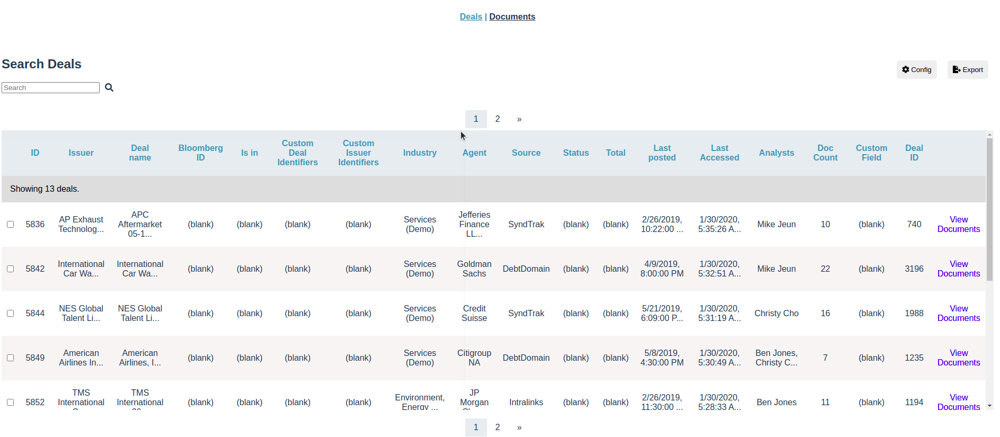
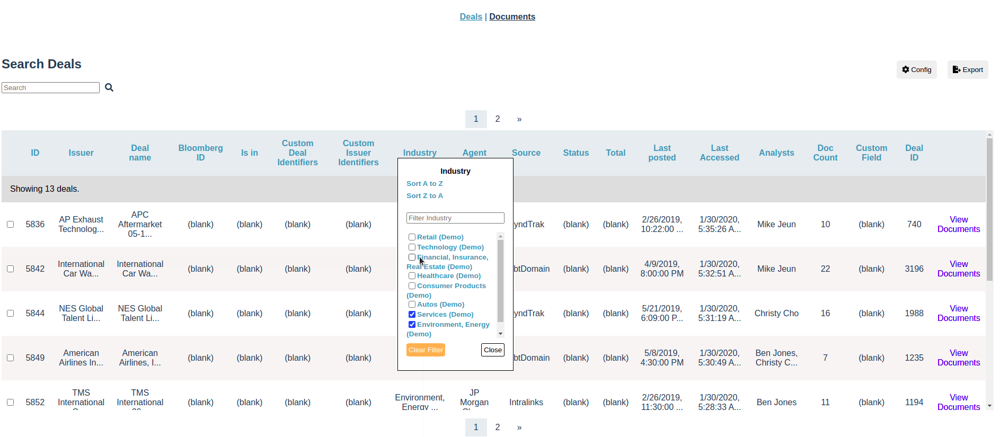
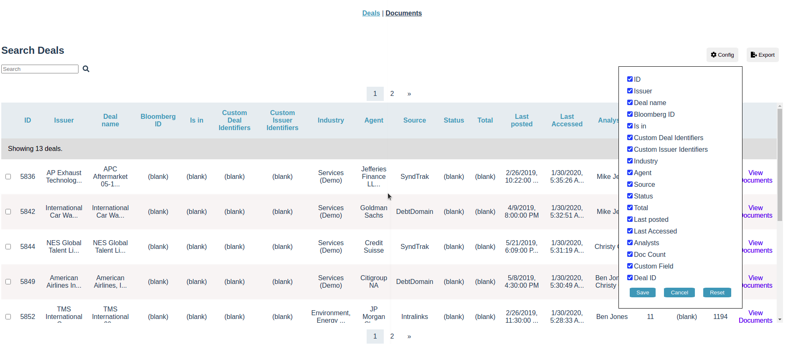
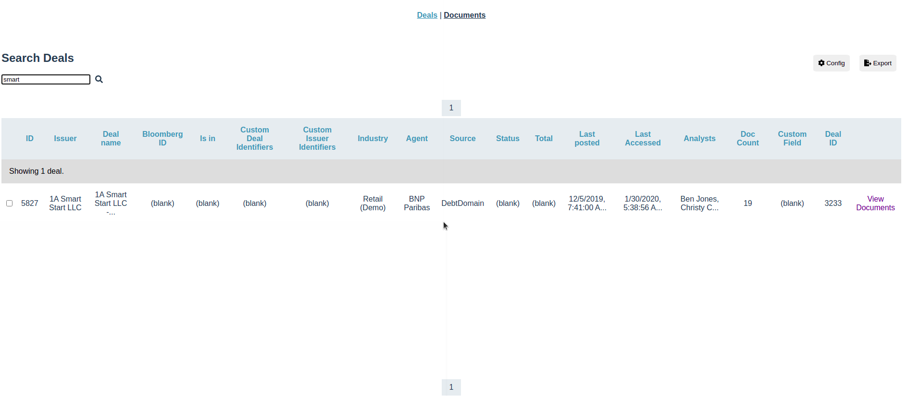

# Vue Grid App

This is a simple Vue 3 app that displays a table with the capacity of:

- Filter by search string
- Filter by columns
- Configure what columns to display
- Sorting (A to Z, Z to A, ascending and descending)
- Exporting based on the filters






## Project setup

```
npm install
```

### Compiles and hot-reloads for development

```
npm run serve
```

### Compiles and minifies for production

```
npm run build
```

### Run your unit tests

```
npm run test:unit
```

### Lints and fixes files

```
npm run lint
```
